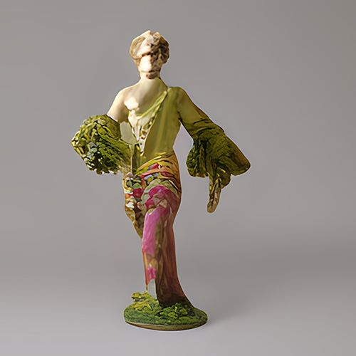

# VA-design-demo

This repository holds the jupyter notebooks for demonstrating the [V&A Design Generator project](https://github.com/ale66/VA-design-demo) where users can input prompts and output images of V&A inspired made up objects representing these prompts. 

Here is an example:

You can either run the notebook locally or you can host it on a web server by running the command: `voila demo.ipynb`

This will host your demo as a link on `localhost:8866`

Note that this notebook depends on model files and data that are saved in Vasari at VA-design-generator/

You will need access to these files in order to run this on a different computer. 
Please reach out to daphnedemekas@gmail.com if you want these files 

Enjoy!

### The team

Our work is funded by [UKRI/AHRC](https://www.ukri.org/councils/ahrc/) via the CapCo call and supported by the [Victoria and Albert Museum](https://www.vam.ac.uk/).

This project is led by [Dr Joel McKim](https://www.bbk.ac.uk/our-staff/profile/8005964/joel-mckim)  directory of the [Vasari Centre for Arts and Technology](http://www7.bbk.ac.uk/vasari/) from Birkbeck, University of London, [Dept. of Film, Media and Cultural Studies](https://www.bbk.ac.uk/departments/culture).

Further members are co-PI [Dr Alessandro Provetti](https://www.bbk.ac.uk/our-staff/profile/8005964/joel-mckim) from Birkbeck, University of London Dept. of Copmputer Science and Information System, [Daphne Demekas](https://github.com/daphnedemekas) and [Jo Lawson-Tancred](https://github.com/JoLawsonTancred).
